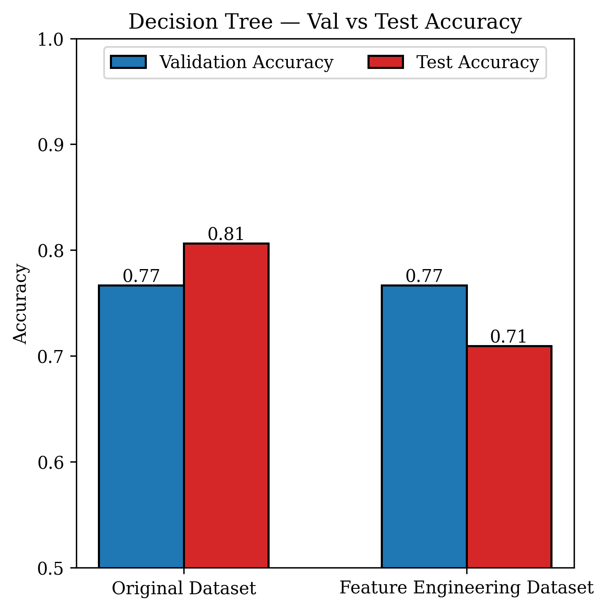
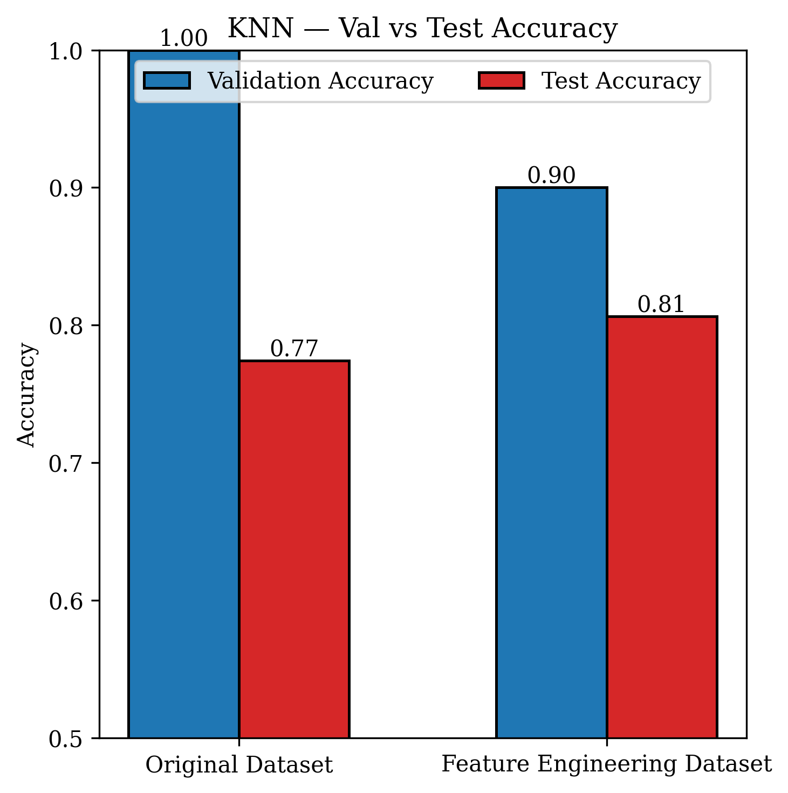
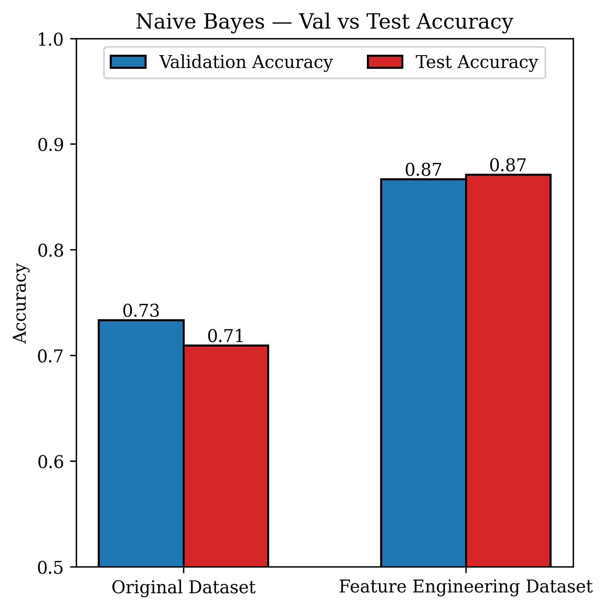
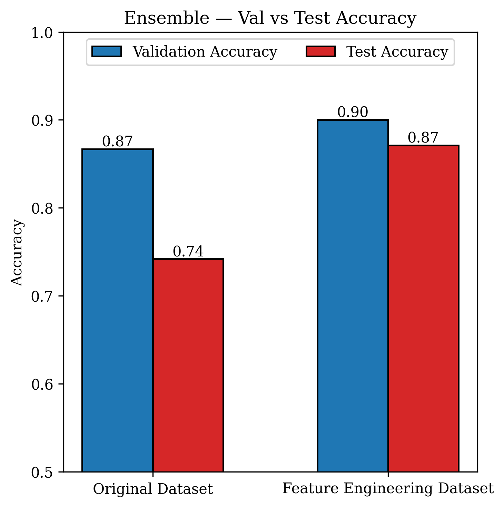

# Heart Disease Diagnosis

Binary classification of heart disease presence using the UCI Cleveland dataset. The project compares four classifiers — Decision Tree, K-Nearest Neighbors, Naive Bayes, and a Stacking Ensemble — across two preprocessing pipelines: raw features and engineered features.

---

## Table of Contents

- [Dataset](#dataset)
- [Project Structure](#project-structure)
- [Installation](#installation)
- [Usage](#usage)
- [Methodology](#methodology)
  - [Preprocessing Pipelines](#preprocessing-pipelines)
  - [Feature Engineering](#feature-engineering)
  - [Models](#models)
- [Results](#results)

---

## Dataset

**Source:** [UCI Machine Learning Repository — Heart Disease Dataset](https://archive.ics.uci.edu/dataset/45/heart+disease)  
**File used:** `processed.cleveland.data` (303 samples, 13 features)

Place the raw CSV at `Data/raw/cleveland.csv`. The target is binarised: `0` = no disease, `1` = disease present (original values 1–4 are collapsed to 1).

| Feature | Description |
|---------|-------------|
| `age` | Age in years |
| `sex` | Sex (1 = male, 0 = female) |
| `cp` | Chest pain type (0–3) |
| `trestbps` | Resting blood pressure (mm Hg) |
| `chol` | Serum cholesterol (mg/dl) |
| `fbs` | Fasting blood sugar > 120 mg/dl (1 = true) |
| `restecg` | Resting ECG results (0–2) |
| `thalach` | Maximum heart rate achieved |
| `exang` | Exercise-induced angina (1 = yes) |
| `oldpeak` | ST depression induced by exercise |
| `slope` | Slope of peak exercise ST segment (0–2) |
| `ca` | Number of major vessels coloured by fluoroscopy (0–3) |
| `thal` | Thalassemia type (1 = normal, 2 = fixed defect, 3 = reversible defect) |

---

## Project Structure

```
Heart-Disease-Diagnosis/
├── Data/
│   ├── raw/
│   │   └── cleveland.csv          # Raw dataset
│   └── split/                     # Generated train/val/test CSVs
│       ├── raw_train.csv
│       ├── raw_val.csv
│       ├── raw_test.csv
│       ├── fe_train.csv
│       ├── fe_val.csv
│       └── fe_test.csv
├── outputs/
│   └── figures/                   # EDA and accuracy comparison plots
├── src/
│   ├── __init__.py
│   ├── data.py                    # DataLoader — ingestion and splitting
│   ├── preprocessing.py           # HeartDiseasePreprocessor — sklearn pipelines
│   ├── visualization.py           # EDAVisualizer + plot_accuracy_comparison
│   └── models.py                  # DecisionTreeModel, KNNModel, NaiveBayesModel, EnsembleModel
├── Feature_Engineering.ipynb      # EDA and feature engineering walkthrough
├── main.py                        # End-to-end training and evaluation script
├── requirements.txt
└── .gitignore
```

---

## Installation

```bash
# Clone the repository
git clone https://github.com/wotttoo/Heart-Disease-Diagnosis.git
cd Heart-Disease-Diagnosis

# Create and activate a virtual environment
python -m venv venv
source venv/bin/activate        # Windows: venv\Scripts\activate

# Install dependencies
pip install -r requirements.txt
```

---

## Usage

Run the full pipeline (EDA → preprocessing → training → evaluation → plots):

```bash
python main.py
```

This will:
1. Load and clean the Cleveland dataset
2. Generate EDA plots in `outputs/figures/`
3. Produce stratified 80/10/10 train/val/test splits saved to `Data/split/`
4. Fit both preprocessing pipelines (raw and feature-engineered)
5. Train and evaluate all four classifiers on both pipelines
6. Save accuracy comparison charts to `outputs/figures/`
7. Print a summary table of val/test accuracy for every model and dataset variant

---

## Methodology

### Preprocessing Pipelines

Two independent pipelines are compared side-by-side:

| Pipeline | Steps |
|----------|-------|
| **Raw** | Imputation (mean / most-frequent) → StandardScaler / OneHotEncoder |
| **Feature Engineering (FE)** | Add engineered features → Imputation → StandardScaler / OneHotEncoder → VarianceThreshold |

Data splits are stratified to preserve class distribution. Only `fit_transform` is called on the training set; validation and test sets use `transform` only to prevent data leakage.

### Feature Engineering

Four ratio features and one binned feature are derived from the original columns:

| Feature | Formula |
|---------|---------|
| `chol_per_age` | `chol / age` |
| `bps_per_age` | `trestbps / age` |
| `hr_ratio` | `thalach / age` |
| `oldpeak_per_age` | `oldpeak / age` |
| `age_bin` | `age` discretised into 5 equal-width bins |

After encoding, low-variance features are removed with `VarianceThreshold`. Features are then ranked by **mutual information** with the target label to select the most informative subset.

### Models

| Model | Implementation | Notes |
|-------|---------------|-------|
| **Decision Tree** | `DecisionTreeClassifier` | Fixed `random_state=42` |
| **KNN** | `KNeighborsClassifier` | Default `k=5` |
| **Naive Bayes** | `GaussianNB` | Assumes feature independence |
| **Ensemble** | `StackingClassifier` | DT + KNN + NB base learners; KNN meta-learner; `stack_method='predict_proba'` |

All model classes expose a consistent `fit(X, y)` / `evaluate(X, y, split_name)` interface.

---

## Results

Accuracy comparison charts are saved under `outputs/figures/`:

| File | Description |
|------|-------------|
| `dt_accuracy.png` | Decision Tree — Val vs Test accuracy |
| `knn_accuracy.png` | KNN — Val vs Test accuracy |
| `nb_accuracy.png` | Naive Bayes — Val vs Test accuracy |
| `ensemble_accuracy.png` | Ensemble — Val vs Test accuracy |

EDA figures (feature distributions, scatter plots, correlation with age) are also stored in `outputs/figures/`.

### Accuracy Comparison Charts

| Decision Tree | KNN |
|:---:|:---:|
|  |  |

| Naive Bayes | Ensemble (Stacking) |
|:---:|:---:|
|  |  |
